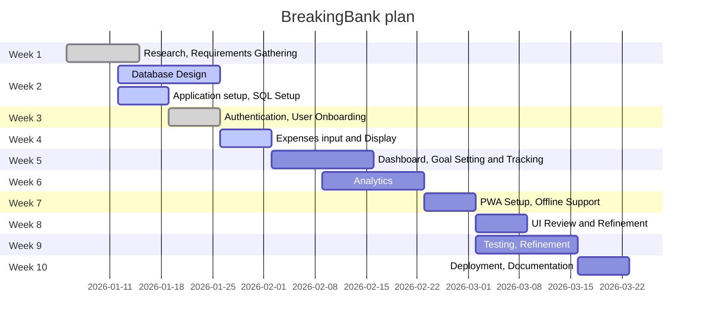

The Gantt chart below shows the project timeline

```mermaid
gantt
    title BreakingBank plan
    dateFormat  YYYY-MM-DD
    section Week 1
    Research, Requirements Gathering :done, 2026-01-05, 10d
    section Week 2
    Database Design :active, 2026-01-12, 14d
    Application setup, SQL Setup :active, 2026-01-12, 7d
    section Week 3
    Authentication, User Onboarding :done, 2026-01-19, 7d
    section Week 4
    Expenses input and Display :active, 2026-01-26, 7d
    section Week 5
    Dashboard, Goal Setting and Tracking : 2026-02-02, 14d
    section Week 6
    Analytics : 2026-02-09, 14d
    section Week 7
    PWA Setup, Offline Support : 2026-02-23, 7d
    section Week 8
    UI Review and Refinement : 2026-03-02, 7d
    section Week 9
    Testing, Refinement : 2026-03-02, 14d
    section Week 10
    Deployment, Documentation : 2026-03-16, 7d
```