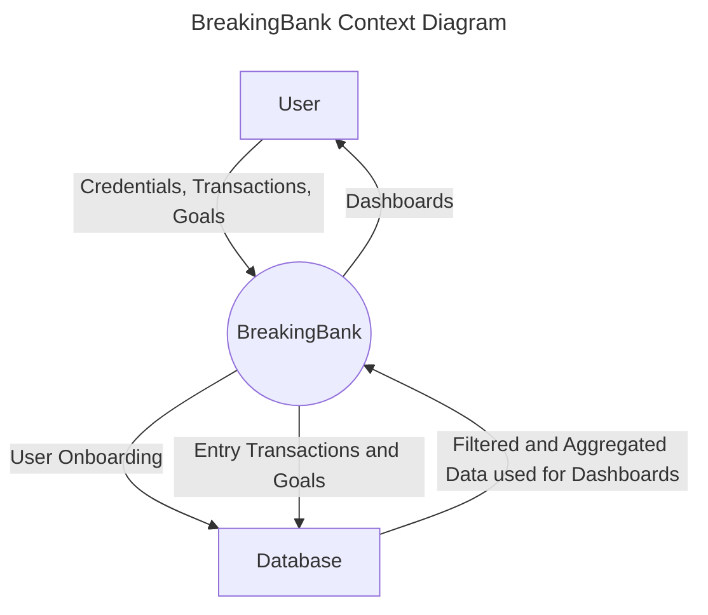
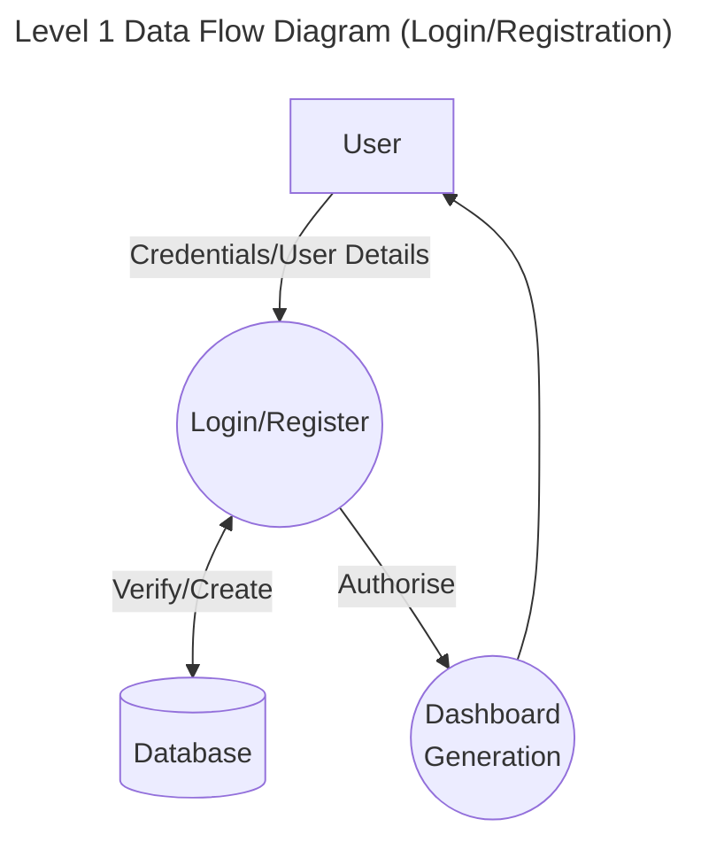
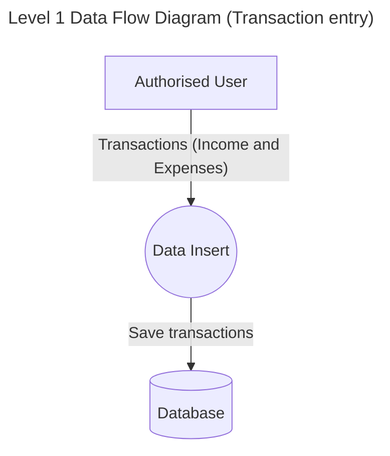
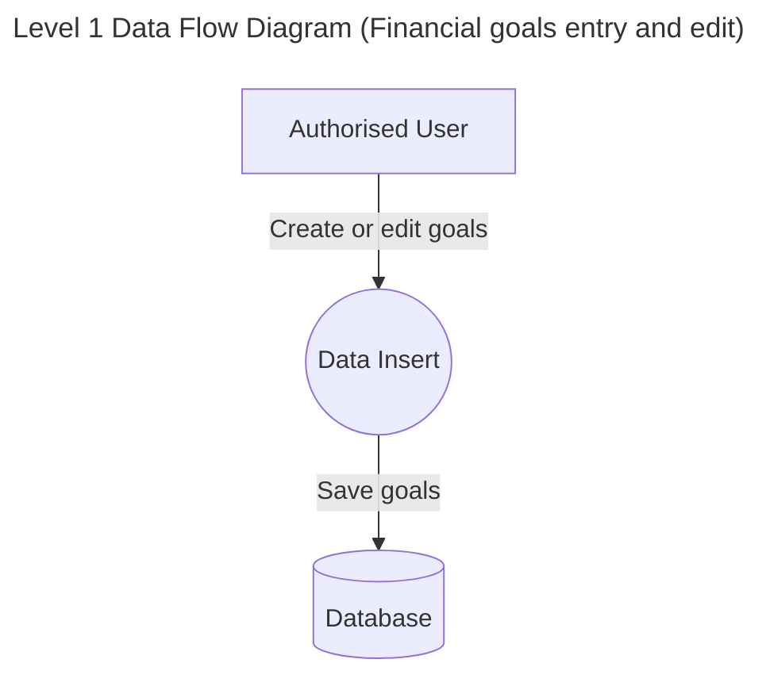
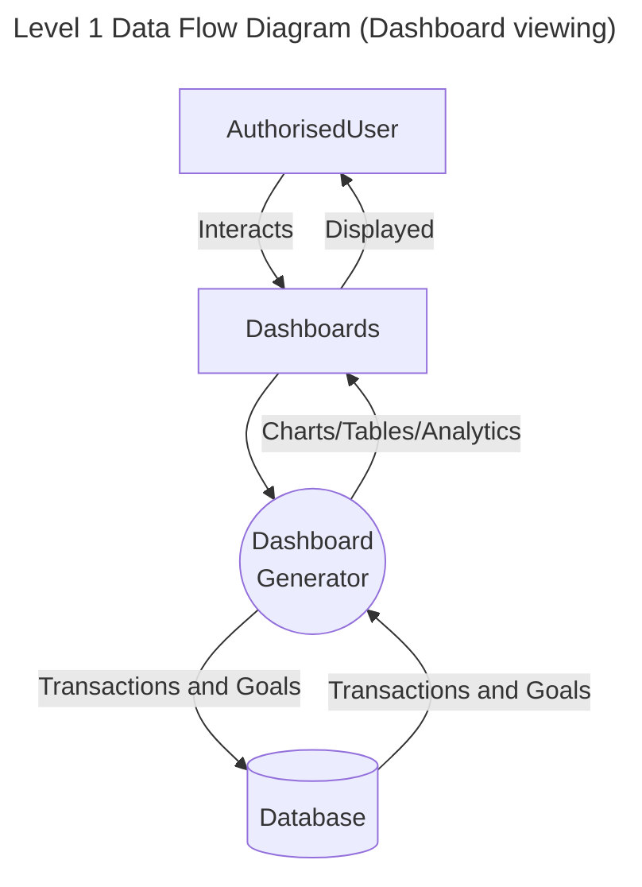

***Level 0 Data Flow Diagram***

The Level 0 Data Flow Diagram (Context Diagram) that identifies the external entities that interact with the application and their interfaces is shown below:
* Users (external entities) interface with the BreakingBank Web application by registering, logging in and interacting with the application by entering the income and expense entries and interacting with application's Dashboards and Analytics
* BreakingBank application performs Authentication and Authorisation based on the user credentials
* BreakingBank application generates budget planning dashboards
* The BreakingBank application is connected to the Database to store and retrieve user data

***The Level 1 Data Flow Diagram***

This section contains the Level 1 Data Flow Diagrams. The Login/registration functionality is shown first:
* New users provide their details for registration (including username, email and password), which BreakingBad validates and saves in the database (password hash is stored instead of the password value) 
* Registered uses provide their credentials, which BreakingBad verifies against the saved user data. 
* If Registration/Login is successful, BreakingBad Authenticates the user by creating a Flask session and Authorises application access

Data entry part of the application functionality is explained below:
* Authorised users enter their expense and income records in the BreakingBank application UI
* BreakingBank application inserts those records in the SQLite database 

The following flow diagram explains the User interaction Goals:

The flow diagram corresponding to the User interaction with the Dashboards and Analytics is shown below:
* Authorised users can access the Dashboards generated by the application.
* Dashboards can contain Charts, Tables and other Analytics and are generated by the application via accessing the transaction and financial goals data in the database. 
* Application fetches the transaction and goals data from the database. Application strictly authorises users to only have access to their own data.
* Once dashboards are generated, they are displayed to the user.
* User can interact with the dashboards by focusing on their individual elements: Charts, Tables, etc

