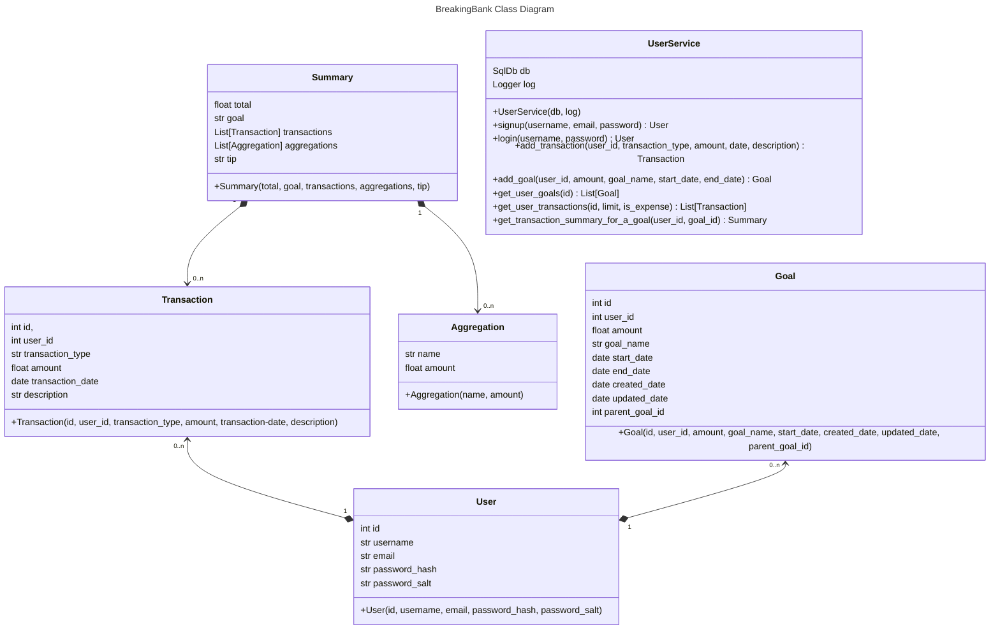

This section contains the class diagram for the BreakingBank application. 

Goal, Transaction and User classes correspond to DB tables. UserService class has functionality to do:
- user login/signup 
- all interaction between the user and the database
- combining of data for presentation
Aggregation class is used for computed total of expenses for a given goal. Summary class contains a list of aggregations, list of transactions, name, total and a tip (analytics) for a goal. 

